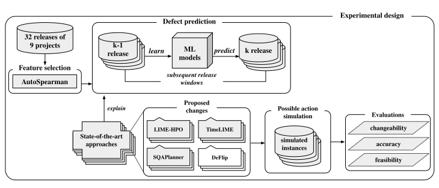
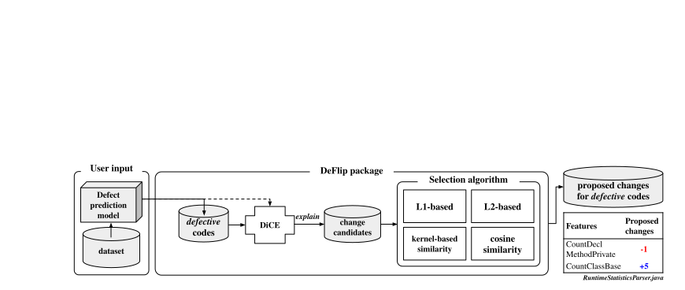

# DeFlip Replication Package

This is the replication package for the paper "Evaluating the Effectiveness of Actionable Guidance for Defect Prediction from Developers' Perspective"

## Abstract



Recent state-of-the-art approaches in defect prediction not only focus on building high-performance machine learning-based models but also aim to generate explanations to provide actionable guidance to developers. These methods identify features that contribute to defect prediction outcomes and propose rules for them, guiding developers with informed code changes to reduce defect risk. However, it is yet unknown whether such actionable guidance satisfactorily meets the needs of developers in practice and is genuinely effective. Previous studies on actionable software analytics have already underscored developers’ needs for clear steps to modify code and flip the defect prediction outcomes. If developers perform the changes proposed by current techniques but the code is still predicted as defective, the practical effectiveness of such guidance diminishes. This study quantitatively evaluates the effectiveness of actionable guidance generated by these techniques from a developer's perspective, based on three newly defined indicators: changeability, accuracy, and feasibility. We also introduce DeFlip, a counterfactual explanation-based defect prediction explainer that prioritizes the needs represented by these indicators. Our findings from 32 releases from nine large-scale Apache projects reveal the challenges developers face in achieving a decision flip, even when adhering to the changes suggested by recent methods. These methods not only fail to propose precise changes for a decision flip but also demand approximately three times the change amount compared to past feature modifications. Through a comparative analysis between DeFlip and these methods, DeFlip exhibits superior performance in terms of changeability and accuracy. Additionally, we analyze the features used by DeFlip and other approaches when proposing changes, discussing the trade-off between making defect prediction explainable and actionable.


## Installation
We recommned to use poetry to install the dependencies. To install poetry, please follow the instructions [here](https://python-poetry.org/docs/#installation).

After installing poetry, you can install the dependencies by running the following command:
```bash
poetry install
poetry shell # activate the virtual environment or you can use `poetry run` to run the following commands
```
 

We use RandomForest as a default defect prediction model. If you want to test with other models, you need to install the following dependencies:
```bash
poetry install -E all_models # xgboost, catboost
```
### Preprocessing

If you want to preprocess the dataset, you need to install the following dependencies:
```bash
poetry install -E preprocess # install rpy2
```

####  Prerequisites
```
R # for AutoSpearman
AutoSpearman # for feature selection
rpy2 
```
Due to the compatibility issue, you may need to install `rpy2` manually.

Our preprocessing steps include:
- Generate (k-1 , k) release (train, test) dataset from original dataset (Yatish et al.)
- Feature selection using AutoSpearman

or you can just use the preprocessed dataset in `Dataset/release_dataset`

## [Dataset](./Dataset/README.md)

## Baselines (Explainers)

## DeFlip



DeFlip is a tool that provides 'actionable guidance' for software defect prediction of black-box models by presenting definitively modifiable alternatives based on counterfactual explanations. It is implemented based on [DiCE](https://github.com/interpretml/DiCE/tree/main).

### Basic Usage
DeFlip takes training data as input to understand the distribution of features and initializes the DeFlip object with a trained model.

```python
from DeFlip import DeFlip

deflip = DeFlip(training_data, rf_classifier, save_path="...")
```
You can easily obtain flipped instances by passing query_instances to the run() method.

```python
deflip.run(test_instance)
```
Simply, you can perform flipping on the dataset experimented with in the paper as follows.


```bash
python DeFlip.py # --get_flip_rate to calculate flip rate
python DeFlip.py --actionable # discussion #2
```
If `actionable == True`, DeFlip will generate actionable guidance by using the features except for inactionable features such as *process metrics* or *ownership metrics*. 

In this case, the feasibility might be a bit lower, however, the flip rate still operates close to 100%.

## Run Explainers to generate proposed changes
for LIME-HPO and TimeLIME: 2 steps
```bash
python run_explainers.py --explainer "LIMEHPO" --project "activemq@2"
python plan_explanations.py --explainer "LIMEHPO" --project "activemq@2" # --only_minimum for MPC
```
The first step generates the explanation-based proposed changes, and the second step generates the all possible changes or the minimum changes.

for SQAPlanner: 3 steps
```bash
python run_explainers.py --explainer "SQAPlanner" --project "activemq@2"
python mining_sqa_rules.py --project "activemq@2" --search_strategy confidence # Requires BigML API key environment variable BIGML_USERNAME and BIGML_API_KEY
python plan_explanations.py --explainer "SQAPlanner" --search_strategy confidence --project "activemq@2" # --only_minimum for MPC
```
The first step generates random neighbor instances using training data, and the second step generates the association rules using BigML API. The third step generates the explanation-based proposed changes.

## Flipping Instances
```bash
python flip_exp.py --explainer "TimeLIME" # RQ1 (a) Flip check with possible flipping proposed changes 
python flip_exp.py --explainer "TimeLIME" --only_minimum # RQ1 (b) Flip check with minimum proposed changes
python flip_exp.py --explainer "TimeLIME" --get_flip_rate # Calculate flip rate
python deflip.py 
```
The flipped instances are stored in `flipped_instances` folder and flip rates are stored in `flip_rates` folder.

Basically, when --only_minimum is False, the perturbation and prediction are repeated until a Decision Flip occurs for the proposed changes. Therefore, Multi Process (ProcessPoolExecutor) is utilized to perform flipping using all cores within the CPU. Please be aware of excessive computational load!

Additionally, on Windows, the ProcessPoolExecutor may not work properly due to the lack of support for the Fork command. It is recommended to run it on WSL (Windows Subsystem for Linux).

## Research Questions Replication

- RQ1: How much decision flip can developers attain when performing the changes proposed by SOTA approaches?: **Flip Rate** (Minimum Proposed Change, possible Flipping Proposed Change)
- RQ2: How accurately do the changes proposed by SOTA approaches guide developers to a decision flip?: **Mean Accuracy**
- RQ3: How much change is required to flip the decisions of SOTA approaches compared to the amount of past change? **Mean Feasibility**
- RQ4: How much more effective actionable guidance does DeFlip provide to developers compared to SOTA approaches?

```bash
python evaluate.py --flip_rate # --explainer "LIME-HPO TimeLIME" ... 
python evaluate.py --accuracy
python evaluate.py --feasibility 
```

In evaluate.py, using the proposed changes and flipped instances generated by each explainer, three quantitative metrics for actionable guidance from a developer's perspective are calculated.

Please refer to research_questions.py for the figures used in the paper.

## Appendix: A summary of the studied software metrics

| Category         | Metrics Level | Metrics                                                                                                                                                              | Count |
|------------------|---------------|-----------------------------------------------------------------------------------------------------------------------------------------------------------------------|-------|
| Code metrics     | File-level    | AvgCyclomaticModified, AvgCyclomaticStrict, AvgEssential, AvgLineBlank, AvgLineComment, CountDeclClass, CountDeclClassMethod, CountDeclClassVariable, CountDeclInstanceMethod, CountDeclInstanceVariable, CountDeclMethodDefault, CountDeclMethodPrivate, CountDeclMethodProtected, CountDeclMethodPublic, CountLineComment, RatioCommentToCode | 16    |
|                  | Class-level   | CountClassBase, CountClassCoupled, CountClassDerived, MaxInheritanceTree, PercentLackOfCohesion                                                                                                  | 5     |
|                  | Method-level  | CountInput_Mean, CountInput_Min, CountOutput_Mean, CountOutput_Min, CountPath_Min, MaxNesting_Mean, MaxNesting_Min                                                                             | 7     |
| Process metrics  |               | ADEV, ADDED_LINES, DEL_LINES                                                                                                                                                                      | 3     |
| Ownership metrics|               | MAJOR_COMMIT, MAJOR_LINE, MINOR_COMMIT, MINOR_LINE, OWN_COMMIT, OWN_LINE                                                                                                                          | 6     |

